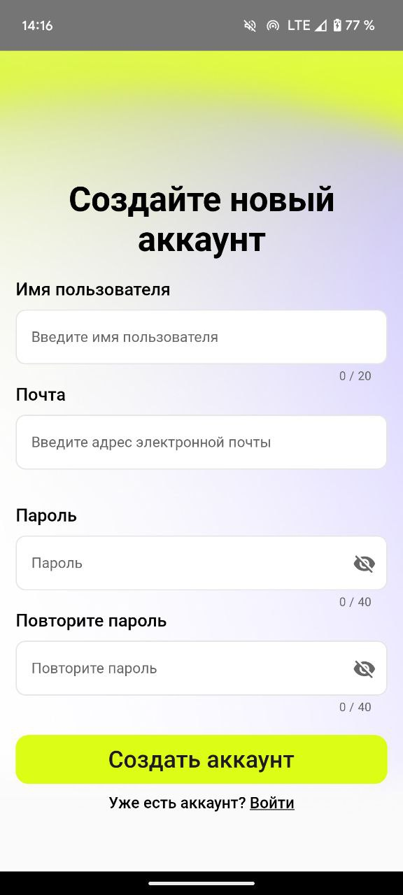
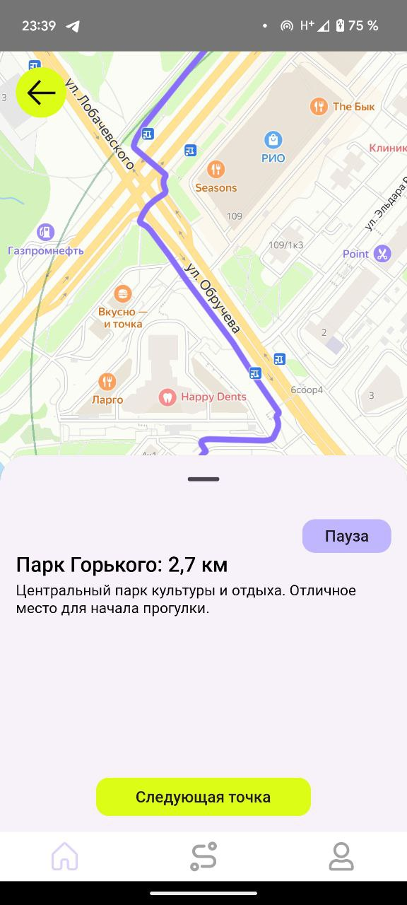

# Руководство оператора

# <a name="kotlin"></a><a name="_toc88172372"></a><a name="_toc55596094"></a>**СОДЕРЖАНИЕ**

[1. Назначение программы](#_toc197280054)

[1.1. Функциональное назначение](#_toc197280055)

[1.2. Эксплуатационное назначение](#_toc197280056)

[2. Условия выполнения программы](#_toc197280057)

[2.1. Минимальный состав аппаратных средств](#_toc197280058)

[2.2. Минимальный состав программных средств](#_toc197280059)

[2.3. Требования к персоналу (пользователю)](#_toc197280060)

[3. Выполнение программы](#_toc197280061)

[3.1. Установка программы](#_toc197280062)

[3.2. Запуск программы и работа с приложением](#_toc197280063)

[3.2.1. Аутентификация](#_toc197280064)

[3.2.2. Главная](#_toc197280065)

[3.2.3. Карточка маршрута](#_toc197280066)

[3.2.4. Профиль](#_toc197280067)

[3.2.5. Мои маршруты](#_toc197280068)

[4. Сообщения оператору](#_toc197280069)

[4.1. Тексты сообщений оператору](#_toc197280070)

[4.2. Действия оператора в исключительных ситуациях](#_toc197280071)

1. **<a name="_toc197280054"></a>Назначение программы**

` `**<a name="_toc197280055"></a>1.1. Функциональное назначение**

Приложение для создания и обмена пешеходными маршрутами предназначено для помощи пользователям в
планировании и организации прогулок. Основные функции приложения включают:

- Создание маршрутов. Пользователи могут создавать маршруты, добавлять в них важные точки и
  сохранять их в черновик для дальнейшего редактирования или публикации.
- Поиск маршрутов. Реализована система поиска с использованием фильтров и сортировки, что позволяет
  находить маршруты, соответствующие заданным критериям и предпочтениям.
- Прохождение маршрутов. Пользователи могут ставить маршруты на паузу, чтобы продолжить прогулку
  позже, не теряя прогресса.
- Сохранение маршрутов. У пользователей есть возможность добавлять понравившиеся маршруты в
  избранное для быстрого доступа в будущем.

Приложение ориентировано исключительно на пешие маршруты, предоставляя инструмент для планирования
прогулок и исследования новых мест.

<a name="_toc197280056"></a>**1.2. Эксплуатационное назначение**

Основными конечными пользователями продукта являются люди, которые интересуются прогулками и
исследованием новых мест. Приложение предоставляет инструменты для планирования маршрутов,
сохранения их для последующего использования, а также поиска и обмена маршрутами с другими
пользователями.

Приложение ориентировано на улучшение качества прогулок, позволяя пользователям находить интересные
маршруты, возвращаться к ранее сохранённым вариантам и делиться своими находками.

<a name="_toc197280057"></a>**2. Условия выполнения программы**

<a name="_toc197280058"></a>**2.1. Минимальный состав аппаратных средств**

- Мобильное устройство с возможностью использования операционной системы Android, оснащенное
  64-разрядным (x64) процессором и камерой
- 100мб оперативной памяти (ОЗУ) или больше
- 500мб свободного места на внутреннем накопителе или больше
- Стабильное подключение к сети интернет

<a name="_toc197280059"></a>**2.2. Минимальный состав программных средств**

Во время испытаний должны быть использованы следующие программные средства:

- Среда разработки Android Studio версии 2023.1.1 RC 2
- Устройство с операционной системой Android версии 7 и выше

<a name="_toc197280060"></a>**2.3. Требования к персоналу (пользователю)**

Для работы с приложением достаточно одного человека, обладающего навыком работы с смартфоном с
операционной системой Android версии 7.0 и выше, а также навыком скачивать и устанавливать
приложения.

Специальных требований к квалификации не предъявляется.

<a name="_toc197280061"></a>**3. Выполнение программы**

<a name="_toc197280062"></a>**3.1. Установка программы**

Мобильное приложение доступно для установки через файл формата .apk. Вы можете загрузить APK файл из
официального github репозитория проекта по
ссылке https://github.com/Coursework-2024-25-WalkingRoutesApp. Загрузка свободная и не требует
регистрации или каких-либо других действий.

<a name="_toc197280063"></a>**3.2. Запуск программы и работа с приложением**

<a name="_toc197280064"></a>**3.2.1. Аутентификация**

После запуска мобильного приложения пользователь попадает на приветственный экран приложения, с
которого можно попасть на страницы Входа и Регистрации. Между экранами входа и регистрации при
необходимости можно переключаться.


                 

*Рисунок 1. Приветственный экран и экраны Входа и Регистрации*

Для входа необходимы следующие данные:

- Адрес электронной почты (в формате user@email.com) вводится в поле “Почта”
- Пароль – состоит минимум из 8 символов (8 – 40 символов), вводится в поле “Пароль”

После ввода данных необходимо нажать на кнопку “Войти”.

- При успешном входе и верифицированном адресе электронной почты пользователь попадает на главный
  экран приложения
- При успешном входе и неверифицированном адресе электронной почты пользователь попадает на экран
  верификации адреса электронной почты
- При неуспешном входе остается на экране входа, при этом он увидит предупреждение о некорректных
  введенных данных.

Для регистрации необходимы следующие данные:

- Имя пользователя (1-20 символов, будет отображаться в профиле и у других пользователей)
- Адрес электронной почты (в формате user@email.com) вводится в поле “Почта”
- Пароль – состоит минимум из 8 символов (8 – 40 символов), вводится в поле “Пароль” и “Повторите
  пароль”

После ввода данных необходимо нажать на кнопку “Регистрация”.

При неуспешной регистрации пользователь остается на экране регистрации, при этом он увидит
предупреждение о некорректных введенных данных.

При успешной попытке регистрации пользователь попадает на экран верификации адреса электронной
почты.


*Рисунок 2. Экран подтверждения email*

Для верификации адреса электронной почты пользователь должен перейти в электронную почту, в письме
от отправителя <godaily.appnotification@gmail.com> взять код подтверждения (состоит из 6 цифр) и
ввести его в приложение в соответствующее поле. После этого нажать “Подтвердить”.

- Если попытка успешна при входе в систему, пользователь попадает на главный экран
- Если попытка успешна при регистрации, пользователь попадает на экран добавления фотографии
- Если попытка неуспешна, пользователь получает соответственное уведомление и может ввести код
  повторно, либо запросить новое отправление кода на почту по кнопке “Отправить повторно”

                  

*Рисунок 3. Экран добавления фотографии пользователя*

После успешной верификации email при регистрации пользователь попадает на экран добавления
фотографии профиля. Этот шаг опциональный: можно пропустить без добавления фотографии или дополнить
свой профиль, выбрав фотографии с устройства. При нажатии любой кнопки и вне зависимости от ответа
сервера о сохранении фотографии пользователь попадает на главную страницу приложения.

**<a name="_toc197280065"></a>3.2.2. Главная**

При успешном входе или успешной регистрации, а также верифицированном адресе электронной почты
пользователь попадает на главный экран приложения:

         

         

*Рисунок 4. Главная*

- Сверху располагается список незавершенных маршрутов, к прохождению которых можно вернуться, в
  разделе “Продолжи маршрут”. Здесь карточки маршрутов листаются горизонтально
- Ниже, в середине экрана расположена строка для поиска маршрутов по названию (при вводе в строку
  поисковый запрос автоматически выполняется), фильтрации маршрутов по категориям и сортировки по
  параметрам. По нажатиям на эти кнопки снизу всплывает меню фильтрации или сортировки. Выбранные
  фильтры автоматически очищаются при поиске по названию. Строка поиска автоматически очищается при
  использовании фильтров.
- Ниже расположен список маршрутов, доступных пользователю, который листается вертикально.
- Мини-карточки маршрутов (в разделе “Продолжи маршрут”) содержат фотографию маршрута, его название
  и расстояние до пользователя (при включенной геолокации и разрешении доступа к ней в приложении),
  иначе расстояние до центра Москвы.
- Мини-карточки маршрутов (основной список) содержат фотографию маршрута; название; расстояние до
  пользователя (при включенной геолокации и разрешении доступа к ней в приложении), иначе расстояние
  до центра Москвы; примерное время прохождения маршрута; категории маршрута в виде иконок в правом
  верхнем углу карточки.
- При нажатии на мини-карточку маршрута в разделе “Главная” открывается карточка маршрута.
- Внизу страницы расположено нижнее меню приложения, с помощью которого можно переходить по разделам
  “Главная”, “Мои маршруты”, “Профиль”

**<a name="_toc197280066"></a>3.2.3. Карточка маршрута**

Перейдя в карточку маршрута, пользователь увидит


*Рисунок 5. Информационная карточка маршрута*

- В верхнем левом углу расположена кнопка «Назад» в виде стрелочки, при нажатии на нее пользователь
  попадет в предыдущий раздел.
- В карточке содержится информация: фотография маршрута, название маршрута, категории маршрута в
  виде тэгов, старт, финиш, описание маршрута, продолжительность маршрута, длина маршрута,
  количество отзывов и рейтинг маршрута.
- На карточке можно добавить маршрут в Избранное, нажав на сердце в правом верхнем углу под
  фотографией
- С карточки можно перейти в раздел отзывов о маршруте:

         

*Рисунок 6. Отзывы о маршруте*

- В разделе отзывов отображаются все отзывы о маршруте, а также можно оставить отзыв, если он еще не
  был оставлен пользователем, нажав на звезду, соответствующую поставленной оценке. Далее будет
  предложено оставить подробный отзыв о маршруте и сохранить его. После сохранения отзыв будет
  сохранен в списке отзывов о маршруте
- В верхнем правом углу находится кнопка переключения вида маршрута с информационной карточки на
  карту маршрута:


*Рисунок 7. Карточка маршрута на карте*

- Карта с маршрутом интерактивная, ее можно двигать, приближать
- По этой же кнопке можно вернуться обратно в информационную карточку маршрута.
- По нажатии на кнопку “В путь” открывается экран прохождения маршрута:

                                    

*Рисунок 8. Прохождение маршрута*

- На начальном экране прохождения можно увидеть начало маршрута на карте, название маршрута и
  название стартовой точки (если оно есть)
- По нажатии кнопки “Начать прохождение”, стартовая точка станет серой (пройденной) и появится
  информация (если она была указана при создании маршрута) о следующей точке (название и описание,
  расстояние до точки), информацию можно развернуть, растянув окно вверх. Окно можно свернуть,
  потянув вниз.
- При нажатии “Следующая точка” пройденная часть маршрута будет становится серой, а информация о
  новых точках обновляться.
- Во время прохождения маршрута также доступен просмотр текущей геолокации на карте (если у
  приложения есть к ней доступ и геолокация корректно загружается)
- При прохождении маршрута доступна возможность приостановить прохождение, нажав на кнопку “Пауза”.
  При этом появится диалоговое окно подтверждения остановки. Такое же окно возникнет, если нажать
  кнопку “Назад” на экране прохождения. При постановке маршрута на паузу, он будет перемещен на
  главную страницу в раздел “Продолжи маршрут”, при этом прогресс прохождения сохраняется. При
  использовании кнопок нижнего меню, прохождение маршрута будет автоматически приостановлено (без
  диалогового окна)
- При переходе к последней точке маршрута пропадет информация о следующей точке, а кнопка “Следующая
  точка” изменится на кнопку “Завершить”. При завершении маршрута возникнет доалоговое окно, в
  котором можно оставить отзыв на пройденный маршрут или отказаться от сохранения отзыва.
- Пройденные маршруты можно посмотреть в профиле пользователя

**<a name="_toc197280067"></a>3.2.4. Профиль**

При переходе в раздел «Профиль» пользователь увидит следующий экран:


*Рисунок 9. Профиль*

- <a name="_hlk162866081"></a>На экране расположена информация: фотография пользователя; имя
  пользователя, кнопка “Редактировать профиль” для перехода на экран редактирования изменения данных
  о пользователе; кнопки для перехода к экранам, на которых можно просмотреть пройденные маршруты и
  избранное; кнопка в правом верхнем углу для просмотра контактов разработчиков и условий соглашений
  приложения.


*Рисунок 10. Редактирование профиля*

- На экране расположено текстовое поле для изменения имени пользователя
- На экране расположена иконка скрепки, при нажатии на нее открывается выбор фотографии из памяти
  устройства.
- Изменения можно применить с помощью кнопки “Сохранить”
- С помощью кнопки “Назад” можно вернуться на экран профиля


*Рисунок 11. О программе*

- Раздел “О программе” содержит информацию о почтах разработчиков (ссылки кликабельны), почте
  приложения, на которую можно направить вопросы о приложении, а также условия использования Яндекс
  карт и кнопка выхода из учетной записи в приложении

         

*Рисунок 12. Разделы “Пройденные маршруты” и “Избранное”*

- Из Профиля можно попасть в разделы пройденных маршрутов и избранных маршрутов. В каждом из этих
  разделов находится список мини-карточек соответствующих маршрутов, по клику на мини-карточку по
  аналогии с главной страницей открываются карточки маршрутов.
- Пройденные маршруты можно проходить снова, при этом при нажатии кнопки “В путь” всплывет окно,
  предлагающее пройти маршрут заново.
- Избранные маршруты – маршруты, отмеченные в карточке по нажатию иконки “Сердце”, из избранного
  маршрут можно удалить, снова нажав соответсвенную иконку в карточке маршрута
- На обоих экранах при нажатии “Назад” пользователь вернется на страницу “Профиль”

**<a name="_toc197280068"></a>3.2.5. Мои маршруты**

При переходе в раздел «Мои маршруты» пользователь увидит следующий экран:


*Рисунок 13. Мои маршруты*

- На экране расположена папка с черновиками маршрутов (если такие есть) и список созданных
  пользователем маршрутов
- Внизу расположена кнопка для создания нового маршрута “Создать маршрута”


*Рисунок 14. Черновики*

- В разделе черновиков находятся мини-карточки неопубликованных маршрутов пользователя, которые были
  сохранены им в черновики ранее. При нажатии на мини-карточку открывается окно создания маршрута с
  частью уже заполненных в предыдущий раз полей. До публикации маршрут и информация о нем может быть
  изменена.

                                    

*Рисунок 15. Создание маршрута*

- При создании маршрута первым открывается экран с интерактивной картой, которую можно двигать и
  масштабировать.
- Точки маршрута на карте выбираются с помощью нажатия на карту
- При нажатии на карту новая точка маршрута начинает отображаться на карте фиолетовой точкой (A –
  если это старт маршрута, точка – если это промежуточная точка, B – финиш маршрута), далее
  всплывает диалоговое окно с возможностью заполнить информацию о точке (название и описание). Эти
  данные будут отображаться при прохождении маршрута другими пользователями. Точку можно оставить
  без названия и описания, для этого нужно в диалоговом окне выбрать соответствующую функцию
- Уже добавленные в маршрут точки можно удалять с помощью кнопки “Назад” в верхнем правом углу карты
- В левом верхнем углу карты расположена строка поиска – геосаджест, с его помощью можно искать
  точки на карте по адресам и названию интересующего объекта. При этом необходимо выбрать подходящий
  вариант из выпадающего списка. После этого выбранная точка будет показана на карте. Чтобы добавить
  ее в маршрут, необходимо, как и любую другую точку маршрута, нажать на карту в нужном месте.
- При создании маршрута доступен просмотр инструкции по созданию маршрута:

      
                 

*Рисунок 16. Инструкция по созданию маршрута*

- После создания маршрута на карте необходимо нажать кнопку “Готово”. После этого будет совершен
  переход к экрану заполнения информации о маршруте
- На экране заполнения информации о маршруте необходимо заполнить поля: название маршрута; описание
  маршрута (опционально); название стартовой точки; название финишной точки; выбрать категории
  маршрута (опционально), выбрать фотографию-обложку маршрута.
- Если далее планируется изменять маршрут, с помощью кнопки “В черновики” черновик маршрута будет
  сохранен в разделе “Черновики” и доступен для редактирования позже. При этом он не будет
  опубликован (то есть не будет виден другим пользователям в общей ленте маршрутов).
- Если маршрут готов к публикации, необходимо выбрать “Опубликовать”. При этом появится
  предупреждение о том, что маршрут не может быть изменен после публикации.
- При удачной публикации маршрута будет отображено соответствующее сообщение, при неудачной будет
  уведомление, почему публикация маршрута не удалась и предложение попробовать еще раз.
- После публикации маршруты можно найти в разделе “Мои маршруты”. Они также появятся в общей ленте в
  разделе “Главная”

         

*Рисунок 17. Публикация маршрута*

**<a name="_toc197280069"></a>4. Сообщения оператору**

<a name="_toc197280070"></a>**4.1. Тексты сообщений оператору**

Сообщения оператору возникают в следующих случаях:

- Сообщения об ошибках (например, о подключении к серверу, при неудачной попытке сохранения данных,
  при некорректных введенных данных)
- Сообщения об успешном выполнении действия (например, “Маршрут добавлен в черновики” или “Маршрут
  успешно опубликован”)
- Предупреждения (“Например, “Маршрут не может быть изменен после публикации”)

Сообщения оператору могут быть переданы двумя способами:

- Диалоговое окно
- Всплывающее уведомление

<a name="_toc197280071"></a>**4.2. Действия оператора в исключительных ситуациях**

В случае возникновения сбоя в приложении или обнаружении некорректной работы приложения пользователь
должен написать на официальный адрес электронной почты
приложения <godaily.appnotification@gmail.com> с подробным объяснением возникшей исключительной
ситуации. Разработчики обязуются исправить программу и выслать новую версию пользователю.

# Инструкция по удалению аккаунта в приложении

## Шаг 1: Подготовьте данные

Перед отправкой запроса убедитесь, что у вас есть:

- Email, привязанный к аккаунту
- Пароль от аккаунта

## Шаг 2: Отправьте запрос

Напишите на почту разработчиков godaily.appnotification@gmail.com письмо с помощью шаблона:

```
Тема письма: Запрос на удаление аккаунта

Email: Ваш email
Пароль от аккаунта:
Причина удаления:

````

При удалении будут полностью удалены данные: Все пользовательские данные, данные о пройденных
маршрутах, избранном, отзывах, созданные маршруты, любая другая информация, связанная с удаляемым
аккаунтов